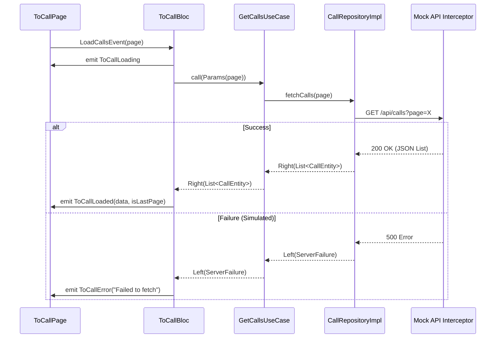
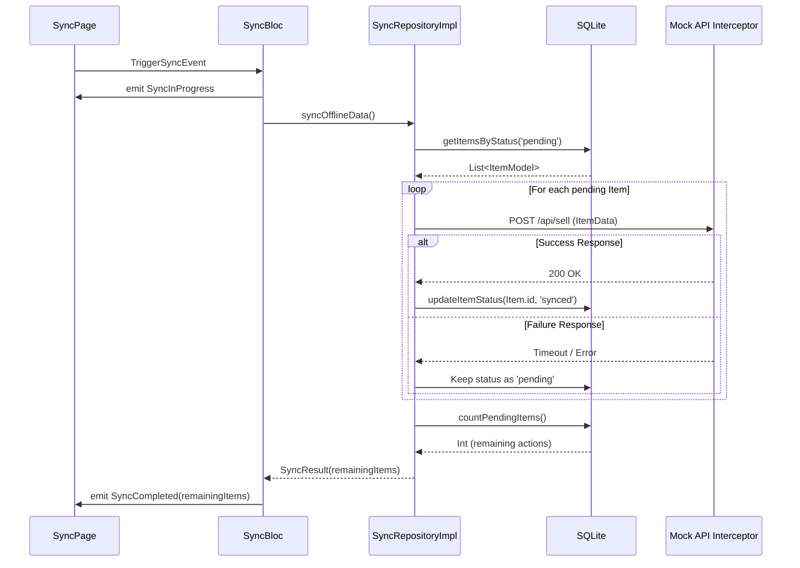

# Sequence Diagrams

## To-Call Data Flow (Remote API)

```mermaid
sequenceDiagram
    participant UI as ToCallPage
    participant Bloc as ToCallBloc
    participant UC as GetCallsUseCase
    participant Repo as CallRepositoryImpl
    participant API as Mock API Interceptor

    UI->>Bloc: LoadCallsEvent(page)
    Bloc->>UI: emit ToCallLoading
    Bloc->>UC: call(Params(page))
    UC->>Repo: fetchCalls(page)
    Repo->>API: GET /api/calls?page=X
    
    alt Success
        API-->>Repo: 200 OK (JSON List)
        Repo-->>UC: Right(List<CallEntity>)
        UC-->>Bloc: Right(List<CallEntity>)
        Bloc->>UI: emit ToCallLoaded(data, isLastPage)
    else Failure (Simulated)
        API-->>Repo: 500 Error
        Repo-->>UC: Left(ServerFailure)
        UC-->>Bloc: Left(ServerFailure)
        Bloc->>UI: emit ToCallError("Failed to fetch")
    end
```

## Sync Module (Hybrid Sync Background Flow)

```mermaid
sequenceDiagram
    participant UI as SyncPage
    participant Bloc as SyncBloc
    participant Repo as SyncRepositoryImpl
    participant DB as SQLite
    participant API as Mock API Interceptor

    UI->>Bloc: TriggerSyncEvent
    Bloc->>UI: emit SyncInProgress
    Bloc->>Repo: syncOfflineData()
    Repo->>DB: getItemsByStatus('pending')
    DB-->>Repo: List<ItemModel>
    
    loop For each pending Item
        Repo->>API: POST /api/sell (ItemData)
        alt Success Response
            API-->>Repo: 200 OK
            Repo->>DB: updateItemStatus(Item.id, 'synced')
        else Failure Response
            API-->>Repo: Timeout / Error
            Repo->>DB: Keep status as 'pending'
        end
    end
    
    Repo->>DB: countPendingItems()
    DB-->>Repo: Int (remaining actions)
    Repo-->>Bloc: SyncResult(remainingItems)
    Bloc->>UI: emit SyncCompleted(remainingItems)
```
